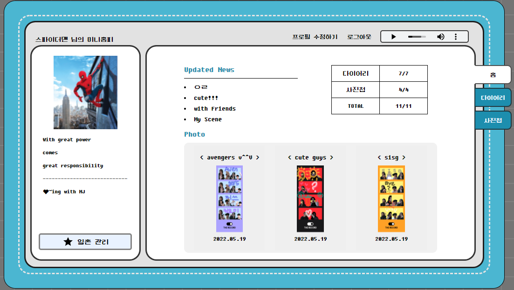
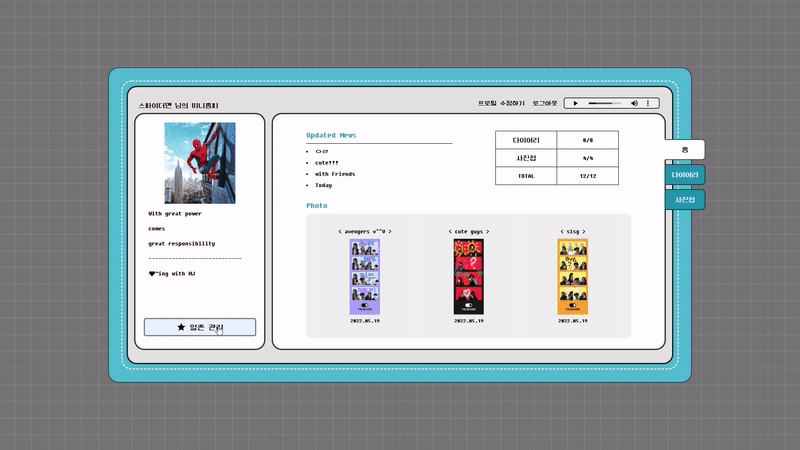
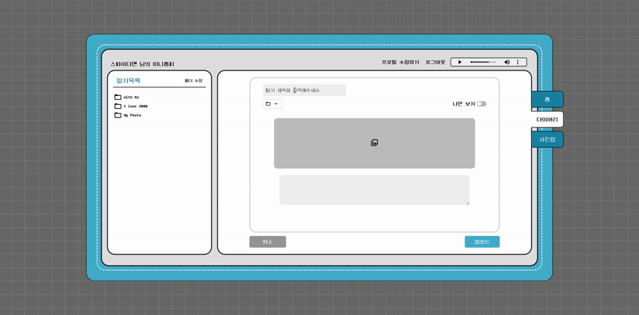
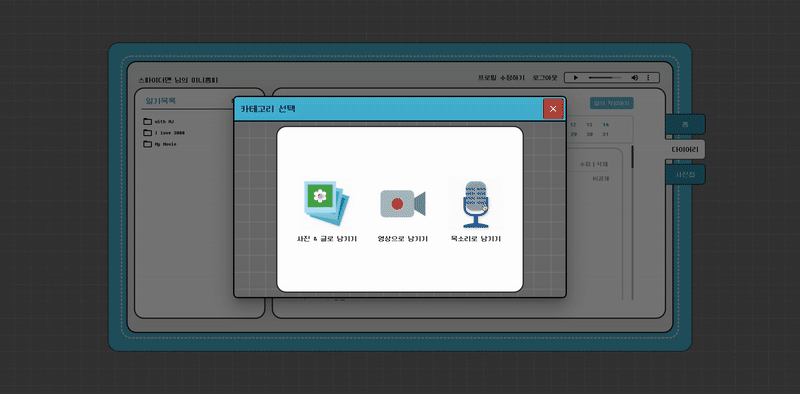
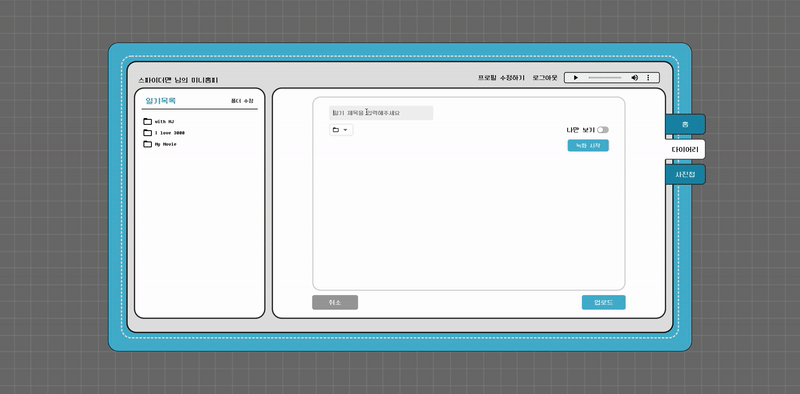
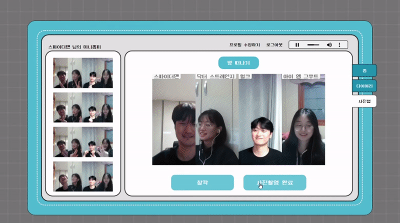
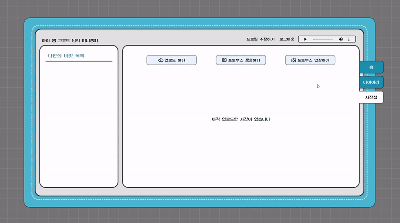
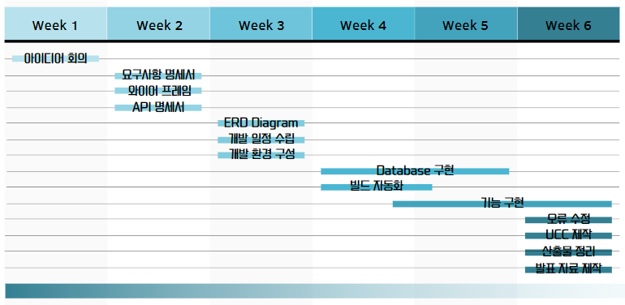
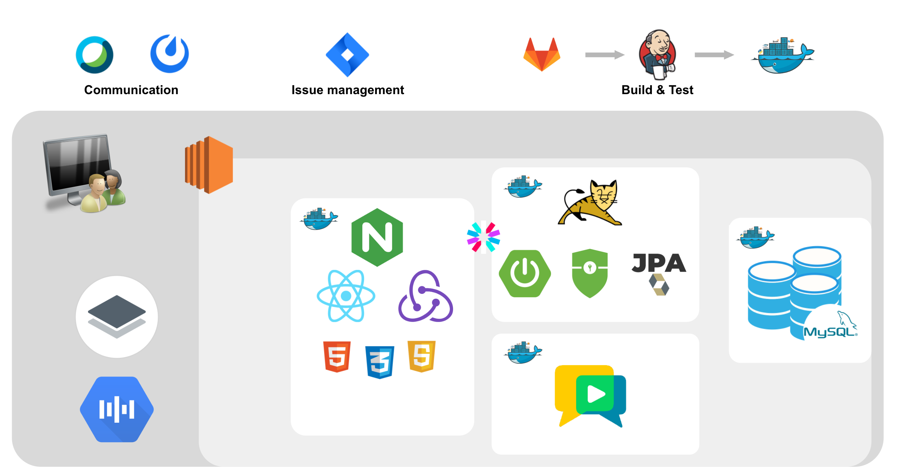
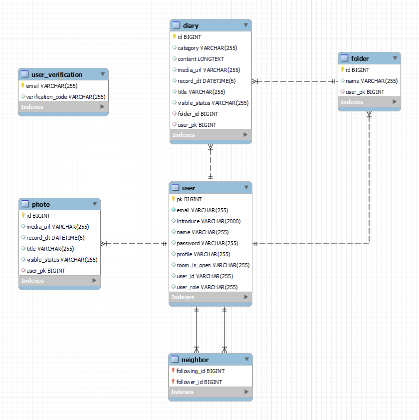

# 🎥 The Record - 당신의 소중한 추억을 기록하는 서비스

 

## 📜 서비스 소개

사용자의 하루를 기록하고 추억을 공유할 수 있는 서비스입니다.

여러분은 오늘 하루를 어떻게 보내셨나요? 

딱딱한 글이 아닌 생동감 넘치는 영상과 사진으로 당신의 하루를 기록해보세요.

또한 요즘 유행하는 인생 네 컷을 간편하게 집에서 촬영하고 꾸미며 친구들과 함께 추억을 공유해보세요.

## 📝 기획 의도

오늘 하루를 기록하고 친구들과 추억을 공유하고자 하는 사람들을 위해 기획하였습니다.

## 🎯 타겟

- 집에서 친구들과 사진을 찍으며 추억을 쌓고 싶은 사람들
- 현재 자신의 모습을 기록 하고 싶은 사람들

## 📅 개발 기간

**2022.04.11 ~ 2022.05.20 (6주)**

## 🔍 주요 기능

### 메인 페이지

- 최신 일기 목록
- 이번 달 업데이트 현황
- 최신 인생 네 컷 목록
 

### 🌟일촌 관리

- 일촌 검색 후 추가
  

### 다이어리
 
- 사진&글 일기 작성  
 
   

- 음성 일기 작성 
 
   

- 영상 일기 작성  
  

### 사진첩

- 포토부스 생성, 배경색 선택 후 입장

 

- 인생 네 컷 로고 & 사진틀 배경색 선택

 

- 인생 네 컷 꾸미기 & 업로드

 

- (방장이 아닌 경우) 방 코드 입력 후 포토부스 입장

### 마이페이지

- 프로필 사진 & 자기소개 수정
 
 

## 📊 Gantt Chart

## 📌 개발 약속

- Git
  - Commit : feat, fix, docs, test
  - Git Flow : master, develop, feature
- React : [Airbnb 네이밍 가이드](https://github.com/apple77y/javascript/tree/master/react#%EB%AA%85%EB%AA%85%EA%B7%9C%EC%B9%99)
- Java : [네이버 Java 컨벤션](https://naver.github.io/hackday-conventions-java/)
  - Spring : [spring 네이밍 컨벤션](https://cocobi.tistory.com/27)
- Rest API
  - URL : 소문자, dash(-) 사용, 행위 X

## 🛠️ 프로젝트 구조

## 🌐 ERD

## 👨‍👨‍👧‍👦 팀원 소개 및 역할 분담

| Name   | Position         | Role                               | Git           |
| ------ | ---------------- | ---------------------------------- | ------------- |
| 장성태 | Frontend         | `팀장` `발표`                      |               |
| 김유정 | Frontend         | 다이어리, 싸이월드 갬성충만        | @yujeong23    |
| 오수경 | Frontend         | 네컷장인, 누끼꾼                   | @ghkdlxld     |
| 오은진 | Backend          | PM, 싸이월드 감성충만              | @Oh-EunJin    |
| 이주형 | Backend          | 백 지휘자, S3 서버 마스터, 🌟멋쟁이 | @leeejuhyeong |
| 조용구 | Backend          | 배포, 환경변수 살인마              | @younygo1004  |
